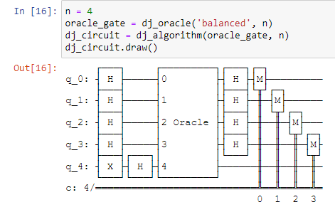
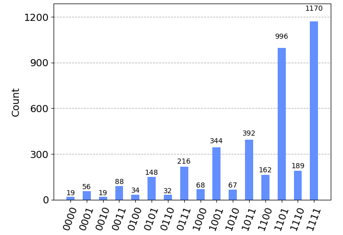

# ⚛️ Unveiling Quantum Advantage: The Deutsch-Jozsa Algorithm

**📅 Project Date:** Summer 2024
**🛠️ Tech Stack:** Python, Qiskit (IBM Quantum), NumPy, Matplotlib
**🔬 Domain:** Quantum Computing & Complexity Theory

---

### 📖 Project Overview
The **Deutsch-Jozsa Algorithm** is one of the first deterministic quantum algorithms to demonstrate exponential speedup over classical computers. It solves the problem of determining whether a hidden Boolean function $f(x)$ is **Constant** (returns all 0s or all 1s) or **Balanced** (returns 0 for half of inputs and 1 for the other half).

**The Quantum Advantage:**
* **Classical Solution:** Requires $2^{n-1} + 1$ queries to the oracle in the worst case ($O(2^n)$).
* **Quantum Solution:** Requires exactly **1 query** to the oracle ($O(1)$), regardless of input size $n$.

This project implements the algorithm using **IBM's Qiskit** framework and verifies the results on the Aer Simulator.

---

### 🏗️ Circuit Architecture
The algorithm utilizes **Superposition** and **Interference** to evaluate all possible inputs simultaneously.

1.  **Initialization:** State prepared in $|0\rangle^{\otimes n} |1\rangle$.
2.  **Superposition:** Hadamard gates ($H$) applied to all qubits to create a superposition of all $2^n$ states.
3.  **Oracle:** A black-box function $U_f$ flips the phase of states where $f(x)=1$.
4.  **Interference:** A second layer of Hadamard gates causes destructive interference for "constant" results if the function is balanced.
5.  **Measurement:** Measuring the input register reveals the nature of the function with 100% certainty.

---

### 📊 Experimental Results
We tested the algorithm on a 3-qubit system. The measurement results show a **100% probability** collapse into the state `111` (indicating a Balanced function in this specific Oracle configuration), confirming the deterministic nature of the algorithm.

*(See `Deutsch_Jozsa_Qiskit.ipynb` for full execution logs)*

---

### 📂 Repository Structure
* `Deutsch_Jozsa_Qiskit.ipynb` - Jupyter Notebook with the Qiskit implementation and Oracle construction.
* `docs/Quantum_Advantage_Paper.pdf` - Research paper explaining the mathematical proofs.
* `docs/Quantum_Presentation.pdf` - Slide deck visualizing the qubit transformations.
* `requirements.txt` - Dependencies for reproducing the quantum simulation.

---

### 🔗 References
* Deutsch, D., & Jozsa, R. (1992). "Rapid solution of problems by quantum computation." *Proceedings of the Royal Society of London*.
* Qiskit Textbook: [https://qiskit.org/textbook](https://qiskit.org/textbook)
